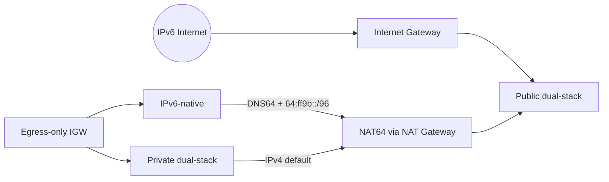

# Key-selected dual-stack and IPv6-native topology

This example concentrates the v5 IPv6 features on one caller-keyed parent selected from the N supported secondary IPv6 associations in a two-AZ VPC:

- an Amazon-provided VPC IPv6 `/56`, selected as `amazon-ipv6`;
- public and private dual-stack subnets with deterministic `/64`s;
- IPv6-native private subnets with no IPv4 CIDR;
- an explicit `ipv6.secondary_cidr_key` on every IPv6 subnet group;
- public `::/0` routes through the Internet Gateway;
- private `::/0` routes through an egress-only Internet Gateway;
- DNS64 on IPv6-native subnets plus managed `64:ff9b::/96` NAT64 routes;
- one public NAT Gateway used for IPv4 egress and NAT64 translation.



`ipv6.cidr_index` pins each group to a six-AZ reservation, so adding an AZ appends a `/64` without moving existing prefixes. `ipv6-native` deliberately omits the IPv4 block and still receives DNS64/NAT64 and direct IPv6 egress.

## Run

The example creates a billable NAT Gateway.

```shell
terraform init
terraform plan
terraform apply
terraform output subnet_ipv6_cidrs
terraform output ipv6_route_counts
terraform destroy
```

Expected route counts with two AZs are two IGW routes, four EIGW routes (two dual-stack application plus two IPv6-native route tables), and two NAT64 routes. If the Region changes, replace `availability_zones` with two valid AZ names from that Region.
