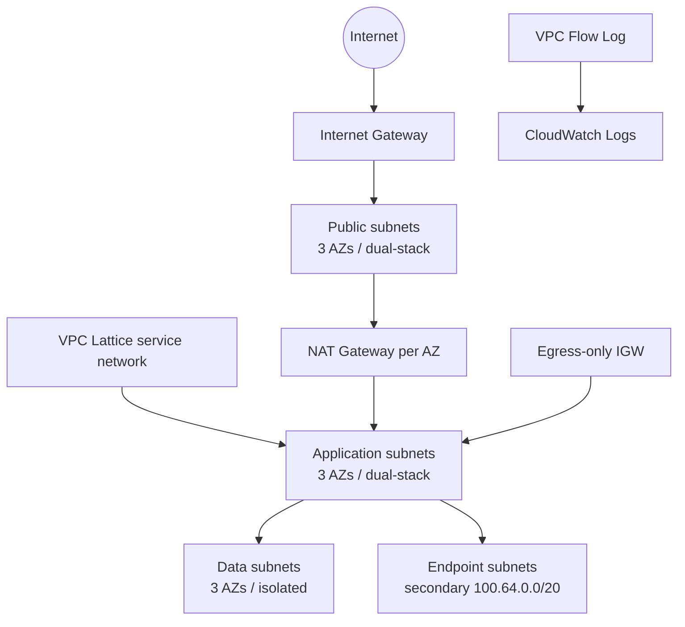

# Enterprise VPC

This example demonstrates a production-oriented, three-AZ v5 topology:

- explicit AZ names and explicit application/data CIDRs;
- a named secondary IPv4 CIDR association consumed by endpoint subnets;
- public and application dual-stack subnets plus IPv4-only isolated tiers;
- one public NAT Gateway per AZ and an egress-only Internet Gateway;
- module-owned CloudWatch Flow Logs with 365-day retention;
- a VPC Lattice service network and typed VPC association;
- layered global, VPC, subnet, and Lattice tags;
- Tier 1 outputs for downstream composition.

## Architecture



The `shared-services` map key is durable Terraform identity for the secondary association. The endpoint subnet group selects it with `secondary_cidr_key`, which also establishes the creation dependency.

## Run

The example creates billable NAT Gateways, CloudWatch Logs, and VPC Lattice resources.

```shell
terraform init
terraform plan
terraform apply
terraform output
terraform destroy
```

The subnet AZ names are fixed to `eu-west-1a`, `eu-west-1b`, and `eu-west-1c`. If `aws_region` changes, update those names and review every explicit CIDR list in the same order.
