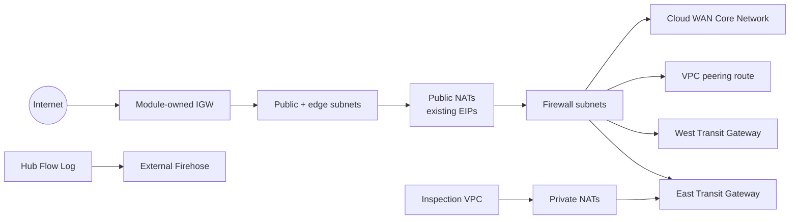

# Network hub and inspection VPCs

This advanced example demonstrates the v5 network-integration boundaries:

- two public subnet groups (`public` and `edge`) in one VPC;
- stable pinned IPv4 and IPv6 allocation;
- two top-level Transit Gateway attachments under stable caller keys (`east` and `west`);
- plural IPv4 and IPv6 TGW route maps that select those attachment keys;
- a generic typed IPv4 route to an existing VPC peering connection;
- a top-level Cloud WAN attachment and multiple Core Network routes;
- a module-created and attached Internet Gateway plus existing NAT EIPs;
- an externally managed Kinesis Data Firehose destination for VPC Flow Logs;
- a second inspection VPC with private NAT Gateways and no EIPs;
- Tier 1 plural attachment and group/role outputs for both VPCs.

The `east`, `west`, and `inspection` keys are caller-owned Terraform state identity.
Keep them stable; changing display names or external IDs does not require changing
these keys.

## Architecture



## Required external resources

The module creates and attaches the hub Internet Gateway. Supply:

- two distinct Transit Gateway IDs under the stable keys `east` and `west`;
- a VPC peering connection ID for the generic `security-services` route;
- a Cloud WAN Core Network ID and matching ARN;
- one EIP allocation ID for each of `us-west-2a`, `us-west-2b`, and `us-west-2c`;
- a Firehose delivery-stream ARN configured to accept VPC Flow Logs.

The typed variables reject malformed or incomplete placeholders before resource creation.

## Run

This example creates billable NAT Gateways and network attachments. Save the
external values in `hub.tfvars`:

```hcl
transit_gateway_ids = {
  east = "tgw-0123456789abcdef0"
  west = "tgw-0223456789abcdef0"
}
vpc_peering_connection_id = "pcx-0123456789abcdef0"
core_network_id            = "cnet-0123456789abcdef0"
core_network_arn           = "arn:aws:networkmanager::123456789012:core-network/cnet-0123456789abcdef0"
flow_log_destination_arn   = "arn:aws:firehose:us-west-2:123456789012:deliverystream/network-hub-vpc-flow-logs"
nat_eip_allocation_ids = {
  us-west-2a = "eipalloc-01111111111111111"
  us-west-2b = "eipalloc-02222222222222222"
  us-west-2c = "eipalloc-03333333333333333"
}
```

```shell
terraform init
terraform plan -out=tfplan -var-file=hub.tfvars
terraform apply tfplan
terraform output
terraform destroy -var-file=hub.tfvars
```

The topology is pinned to `us-west-2`. Changing Region requires updating the explicit AZ keys and every external ARN/ID consistently.
