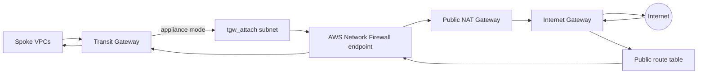

# Centralized inspection with internet egress

This example is the production hub-and-spoke inspection pattern: spoke traffic enters an inspection VPC through a Transit Gateway attachment, crosses the AZ-local AWS Network Firewall endpoint, and exits through an AZ-local public NAT Gateway. Return traffic from each public route table is sent back through the firewall endpoint before reaching the Transit Gateway.

The VPC uses `100.64.0.0/16` and three subnet groups in every AZ:

- `public` (`role = "public"`): hosts public NAT Gateways and routes post-inspection traffic to the Internet Gateway;
- `firewall` (`role = "private"`): hosts Network Firewall endpoints; its route table sends `0.0.0.0/0` to NAT and spoke destinations to the TGW;
- `tgw_attach` (`role = "transit_gateway"`): hosts the Transit Gateway ENIs and enables appliance mode.



## Why appliance mode is mandatory

AWS Network Firewall is stateful. `appliance_mode_support = true` on the TGW VPC attachment preserves AZ affinity for the lifetime of a flow, so forward and return packets traverse the same firewall endpoint. Without appliance mode, TGW can select a different attachment AZ on the reverse path; the firewall then lacks matching state and drops the traffic.

The example disables default TGW route-table association and propagation so the hub routing policy remains explicit and centrally governed.

## Prefix-list return routing

`firewall.routing.transit_gateway_attachments.inspection = [var.spoke_prefix_list_id]` demonstrates that the typed route list accepts customer-managed prefix list IDs (`pl-...`) as well as IPv4 CIDRs. Both forms can coexist in the same list. The following is a fragment of `subnets.<group>.routing`, not a root argument:

```text
transit_gateway_attachments = {
  inspection = [
    var.spoke_prefix_list_id,
    "192.168.0.0/16",
  ]
}
```

The prefix list must contain the spoke destinations that return through the TGW. Keep it consistent with `spoke_network_cidr_blocks`, which the Network Firewall composition uses to install return routes in public route tables.

## AWS Network Firewall composition

`main.tf` materializes a `local.network_firewall_composition` entirely from Tier 1 VPC outputs:

- `subnet_ids_by_group_by_az["firewall"]` supplies endpoint subnets;
- `route_table_ids_by_group_by_az["tgw_attach"]` supplies connectivity route tables where the Network Firewall module installs AZ-local default routes to firewall endpoints;
- `route_table_ids_by_group_by_az["public"]` supplies public route tables where it installs spoke return routes through firewall endpoints.

A ready-to-enable `aws-ia/networkfirewall/aws` block is included as comments in `main.tf`. It uses `routing_configuration.centralized_inspection_with_egress`. Before enabling it, select and pin a reviewed module release and supply `network_firewall_policy_arn`. Keeping the registry module commented makes this VPC example deterministic and self-contained for CI validation while preserving the exact integration contract.

## Cloud WAN variant

For a Cloud WAN hub, replace `tgw_attach` with a group using `role = "core_network"` and `core_network_options = { id, arn, appliance_mode = true }`. Change the firewall return list to `routing.core_network = [var.spoke_prefix_list_id]`, and feed that group's `route_table_ids_by_group_by_az` map into `connectivity_subnet_route_tables`. Public, firewall, NAT, and Network Firewall routing remain otherwise equivalent.

## Run

The VPC example creates three public NAT Gateways and a TGW attachment. The commented Network Firewall module creates additional billable resources only after explicitly enabled.

```shell
terraform init
terraform plan \
  -var='transit_gateway_id=tgw-0123456789abcdef0' \
  -var='spoke_prefix_list_id=pl-0123456789abcdef0'
terraform apply \
  -var='transit_gateway_id=tgw-0123456789abcdef0' \
  -var='spoke_prefix_list_id=pl-0123456789abcdef0'
terraform output network_firewall_inputs
terraform destroy \
  -var='transit_gateway_id=tgw-0123456789abcdef0' \
  -var='spoke_prefix_list_id=pl-0123456789abcdef0'
```
