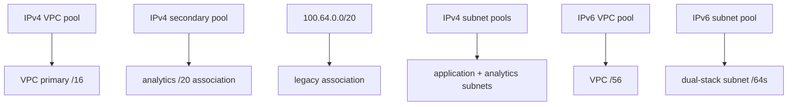

# Mixed-family IPv4 and IPv6 IPAM

This example demonstrates every IPAM boundary in the v5 addressing contract:

- the mandatory VPC primary IPv4 `/16` allocated from IPAM;
- N caller-keyed secondary IPv4 associations, illustrated by one IPAM `/20` and one static `/20`;
- N caller-keyed secondary IPv6 associations, illustrated by one IPAM `/56`;
- application subnets allocated from a primary-CIDR subnet pool;
- analytics subnets allocated from a secondary-CIDR subnet pool and linked by `ipv4.secondary_cidr_key`;
- dual-stack application and analytics groups explicitly linked to `ipv6-ipam` by `ipv6.secondary_cidr_key`;
- an IPv6-only `ipv6-native` group allocated as `/64`s from the same selected IPv6 parent;
- stable family-specific secondary-association IDs exposed through Tier 1.



The pool hierarchy and allocations must already exist in VPC IPAM and be shareable with the applying account. This module consumes pool IDs; it does not create IPAM, scopes, pools, or pool allocations.

## Run

Replace every placeholder pool ID with IDs from the selected Region and save them in `ipam.tfvars`:

```hcl
vpc_ipv4_ipam_pool_id              = "ipam-pool-REAL"
secondary_ipv4_ipam_pool_id        = "ipam-pool-REAL"
subnet_ipv4_ipam_pool_id           = "ipam-pool-REAL"
secondary_subnet_ipv4_ipam_pool_id = "ipam-pool-REAL"
vpc_ipv6_ipam_pool_id              = "ipam-pool-REAL"
subnet_ipv6_ipam_pool_id           = "ipam-pool-REAL"
```

```shell
terraform init
terraform plan -out=tfplan -var-file=ipam.tfvars
terraform apply tfplan
terraform output
terraform destroy -var-file=ipam.tfvars
```

Keep the `analytics` and `legacy` map keys stable: they are Terraform resource identity for the secondary associations. IPAM-allocated CIDRs are apply-time values, while their pool IDs, netmasks, and association keys remain plan-known.
