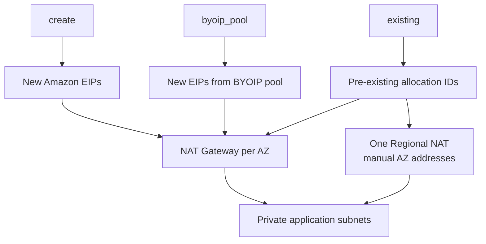

# NAT Gateway EIP sourcing and Regional NAT

This example compares the three zonal public NAT EIP contracts and adds one Regional NAT manual-address variant:

1. `create`: allocate ordinary Amazon public EIPs for zonal NAT;
2. `byoip_pool`: allocate new zonal EIPs from a customer-owned public IPv4 pool;
3. `existing`: attach caller-supplied EIPs to zonal NAT without owning their lifecycle;
4. `regional_existing`: create one VPC-level Regional NAT and pass the same caller-owned EIPs through provider `availability_zone_address` blocks, with no public subnet.



The three zonal modules create two Gateways each. The Regional module creates one Gateway, repeats its ID under both configured AZ keys for routing/output compatibility, and uses its AWS-managed route table to reach the IGW.

## Run

The defaults for the BYOIP pool and existing allocation IDs are syntax-safe placeholders. Replace them with resources from the selected account and Region before applying. This example creates six zonal NAT Gateways plus one Regional NAT billed per active AZ.

Save the external values in `nat-byoip.tfvars`:

```hcl
public_ipv4_pool = "ipv4pool-ec2-REAL"
existing_eip_allocation_ids = {
  us-east-1a = "eipalloc-REAL1"
  us-east-1b = "eipalloc-REAL2"
}
```

```shell
terraform init
terraform plan -out=tfplan -var-file=nat-byoip.tfvars
terraform apply tfplan
terraform output nat_eip_allocation_ids
terraform destroy -var-file=nat-byoip.tfvars
```

`existing_eip_allocation_ids` keys must exactly equal the NAT AZ set. The existing EIPs remain caller-owned after destroy; EIPs allocated in `create` and `byoip_pool` modes are module-owned.


## Regional mode trade-offs

For new public internet egress, `mode = "regional"` is the operational default to consider: AWS follows ENI presence across AZs, maintains zonal affinity, and does not require public host subnets. It is not a lower hourly-cost shortcut—AWS charges one NAT Gateway-hour per active AZ. ENIs that remain present can keep an AZ active and billed. Expansion averages 15–20 minutes and can take up to 60 minutes; traffic may cross AZs (and incur transfer charges) until expansion completes. Regional NAT supports up to 32 public IPs per AZ and public connectivity only. Keep zonal mode for private NAT.

`eip.mode = "create"` selects AWS automatic Regional NAT IP/AZ management. This example intentionally uses `existing` to demonstrate deterministic allowlisting; `byoip_pool` is also supported in regional manual mode and creates one pool-backed EIP per configured AZ. Switching between automatic mode (no address blocks) and manual mode recreates the Regional NAT Gateway per provider semantics.
