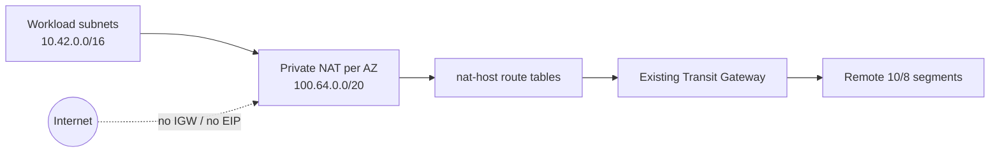

# Private NAT toward an overlapping TGW address domain

This example demonstrates private NAT Gateways with an explicit host subnet group and no public EIPs. It models a VPC whose workload addresses (`10.42.0.0/16`) overlap the broader `10.0.0.0/8` address plan used behind a Transit Gateway.

The route chain is intentionally split by subnet group:

1. workload route tables send default IPv4 traffic to the AZ-local private NAT Gateway;
2. private NAT Gateways live in `nat-host`, whose addresses come from the non-overlapping `100.64.0.0/20` secondary CIDR;
3. `nat-host` route tables send only the required remote segments (`10.100.0.0/16` and `10.200.0.0/16` by default) to the Transit Gateway;
4. TGW attachment subnets also use the translation CIDR and never require an IGW or EIP.

The private NAT translates the overlapping workload source addresses into the `100.64.0.0/20` domain before TGW routing. The narrower destination routes avoid attempting to override the VPC's immutable local route for its own `10.42.0.0/16` CIDR.



## Required external resource

Supply an existing Transit Gateway ID. The example creates its VPC attachment but does not own the Transit Gateway or its route-table propagation/associations.

## Run

Private NAT Gateways are billable resources.

```shell
terraform init
terraform plan -var='transit_gateway_id=tgw-0123456789abcdef0'
terraform apply -var='transit_gateway_id=tgw-0123456789abcdef0'
terraform output route_counts
terraform destroy -var='transit_gateway_id=tgw-0123456789abcdef0'
```

When changing AZs, update the explicit subnet CIDR lists in the same order. Replace the destination list with the exact remote segments that require translated access; do not route the VPC's own local CIDR through NAT or TGW.
