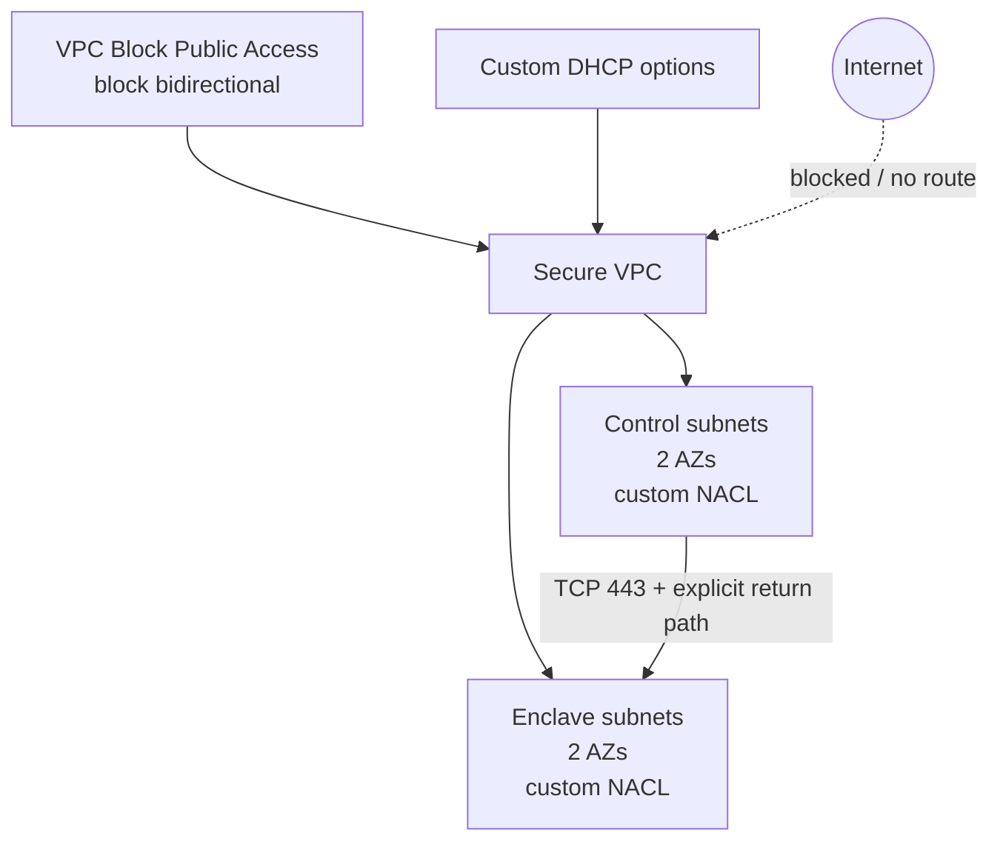

# Secure isolated enclave

This example combines the v5 D6 controls into a topology without Internet or transit routing:

- VPC Block Public Access in `block-bidirectional` mode;
- a custom DHCP option set with a private domain, Amazon-provided DNS, and Amazon Time Sync;
- opt-in adoption of the AWS-created default security group, network ACL, and route table;
- explicit per-group NACLs allowing only control-to-enclave TLS plus its stateless return path;
- two subnet groups whose semantic role is exclusively `isolated`;
- no Internet Gateway, egress-only Internet Gateway, NAT Gateway, or Internet/transit route.

Use this pattern for restricted processing zones, offline control planes, regulated data enclaves, or workloads whose ingress and egress must traverse separately governed private endpoints or inspection infrastructure. Isolated groups may opt into S3/DynamoDB gateway endpoints without becoming Internet-routed; use `private` for TGW, Cloud WAN, NAT, or broader routing.



## Default-resource adoption warning

`default_resources` does not create replacements. It adopts AWS-created defaults.
On first apply, security-group rules, default NACL allow rules, non-local default
routes, and propagated gateways are removed. Enabling it in a live VPC can break
workloads still using those defaults; inventory dependencies and move workloads to
explicit SGs, NACLs, and route tables first. All selectors default to `false`, so
existing deployments and v4 migration plans remain unchanged unless explicitly
enabled.

## Stateless NACL warning

NACLs are stateless: every allowed request path needs a separate reverse-direction
rule. The example permits control-to-enclave TCP/443 and explicitly permits the
1024–65535 response path; all unmatched traffic remains denied. Rule map keys are
the AWS rule numbers, so reordering source declarations does not change state.

Do not add NACLs merely to duplicate security-group policy. Prefer stateful security
groups when workload identity is sufficient, return-port management would be
fragile, or teams cannot test both traffic directions. Use NACLs for deliberate
subnet-boundary defense in depth, coarse deny controls, or compliance boundaries.
Omitting `network_acl` preserves AWS default-NACL behavior.

## Regional singleton warning

`aws_vpc_block_public_access_options` is an account/Region singleton. Manage it from exactly one module instance. Applying this example changes the regional setting and can affect other VPCs in the account, so use an isolated test account or coordinate the change with the account networking owner.

## Run

```shell
terraform init
terraform plan
terraform apply
terraform output egress_resources
terraform destroy
```

A clean plan should show no IGW, NAT Gateway, EIGW, or egress routes. Destroy removes the regional BPA configuration created by this example, so do not use it as an uncoordinated demonstration in a shared account.
