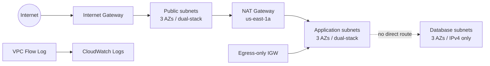

# Basic three-AZ VPC

This example is the smallest deployable v5 web-application topology. It demonstrates:

- one public, one private application, and one isolated database subnet per AZ;
- Amazon-provided IPv6 on the VPC and dual-stack public/application subnets;
- one public NAT Gateway shared by all application subnets;
- DNS64/NAT64 and egress-only Internet Gateway routing for application subnets;
- IPv4-only isolated database subnets, whose Tier 1 IPv6 output is `null`;
- a module-owned CloudWatch Logs destination, IAM delivery role, and VPC Flow Log;
- Tier 1 outputs by group, semantic role, and Availability Zone.

## Architecture



`availability_zones.count` keeps the example concise, but it is development-only. Production configurations should use explicit AZ names and explicit CIDRs (or pinned `cidr_index` values) to keep state identity stable.

## Run

The example creates billable NAT Gateway and CloudWatch Logs resources.

```shell
terraform init
terraform plan
terraform apply
terraform output
terraform destroy
```

Override the default Region if needed:

```shell
terraform plan -var='aws_region=us-west-2'
```

When changing the Region, also replace the hard-coded single-NAT AZ in `main.tf` with an AZ from that Region.
