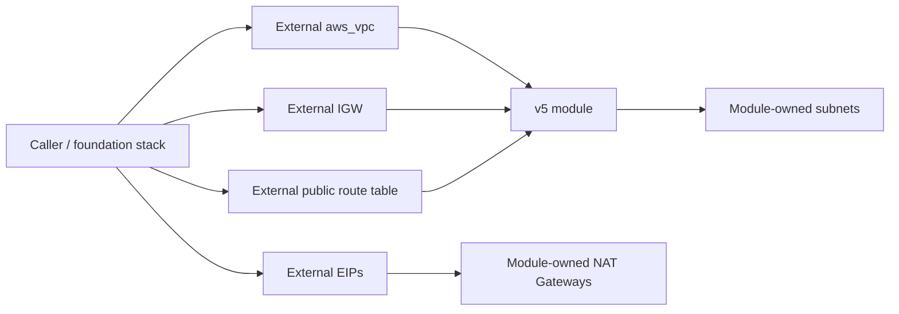

# Existing VPC and injected network boundaries

This example demonstrates v5's create-or-inject contract. The root configuration creates a plain `aws_vpc`, Internet Gateway, shared public route table, and one EIP per AZ, then passes their computed IDs into the module. The module creates only the subnets, route-table associations and routes, and NAT Gateways that remain inside its ownership boundary.

The key settings are:

- `vpc.create = false` plus `vpc.id` for the externally created VPC;
- `vpc.igw_create = false` plus `vpc.igw_id` for the attached external IGW;
- `manage_route_table = false` plus `route_table_id` for a shared external public route table;
- `nat_gateway.eip.mode = "existing"` with external EIP allocation IDs;
- explicit booleans deciding ownership while IDs may remain computed until apply.

v4 inferred and created most boundary resources as part of one monolithic lifecycle. v5 separates ownership from identity: callers can inject selected resources without making Terraform collection cardinality depend on unknown IDs. The root module owns the demonstration resources here only so the example is deployable; a production caller would normally receive them from a separate network foundation stack.



## Run

This example creates billable NAT Gateways and EIPs. Destroying the module in a separately composed production stack would not destroy injected resources; in this self-contained example the root configuration still owns and destroys them.

```shell
terraform init
terraform plan
terraform apply
terraform output module_ownership
terraform destroy
```

Keep AZ names and `aws_region` aligned when overriding defaults.
