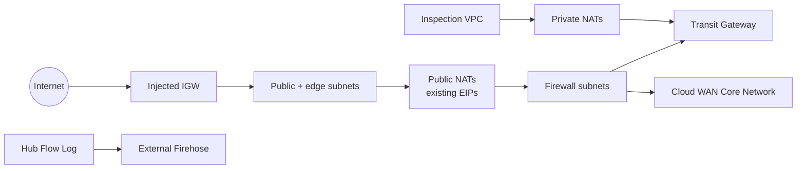

# Network hub and inspection VPCs

This advanced example demonstrates the v5 network-integration boundaries:

- two public subnet groups (`public` and `edge`) in one VPC;
- stable pinned IPv4 and IPv6 allocation;
- dedicated Transit Gateway and Cloud WAN attachment subnet roles;
- multiple IPv4 and IPv6 TGW/Core Network routes per subnet group;
- an injected Internet Gateway and existing EIPs;
- an externally managed Kinesis Data Firehose destination for VPC Flow Logs;
- a second inspection VPC with private NAT Gateways and no EIPs;
- Tier 1 group/role outputs for both VPCs.

## Architecture



## Required external resources

The example intentionally does not create organization-owned hub dependencies. Supply:

- an Internet Gateway already attached to the hub VPC lifecycle boundary;
- a Transit Gateway;
- a Cloud WAN Core Network ID and matching ARN;
- one EIP allocation ID for each of `us-west-2a`, `us-west-2b`, and `us-west-2c`;
- a Firehose delivery-stream ARN configured to accept VPC Flow Logs.

The typed variables reject malformed or incomplete placeholders before resource creation.

## Run

This example creates billable NAT Gateways and network attachments.

```shell
terraform init
terraform plan \
  -var='existing_igw_id=igw-0123456789abcdef0' \
  -var='transit_gateway_id=tgw-0123456789abcdef0' \
  -var='core_network_id=cnet-0123456789abcdef0' \
  -var='core_network_arn=arn:aws:networkmanager::123456789012:core-network/cnet-0123456789abcdef0' \
  -var='flow_log_destination_arn=arn:aws:firehose:us-west-2:123456789012:deliverystream/network-hub-vpc-flow-logs' \
  -var='nat_eip_allocation_ids={us-west-2a="eipalloc-01111111111111111",us-west-2b="eipalloc-02222222222222222",us-west-2c="eipalloc-03333333333333333"}'
terraform apply
terraform output
terraform destroy
```

The topology is pinned to `us-west-2`. Changing Region requires updating the explicit AZ keys and every external ARN/ID consistently.
