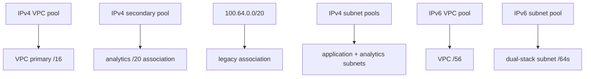

# IPv4 and IPv6 IPAM

This example demonstrates every IPAM boundary in the v5 addressing contract:

- the VPC primary IPv4 `/16` allocated from IPAM;
- one named secondary IPv4 `/20` allocated from IPAM;
- one named static secondary IPv4 CIDR alongside it;
- application subnets allocated from a primary-CIDR subnet pool;
- analytics subnets allocated from a secondary-CIDR subnet pool and linked by `secondary_cidr_key`;
- a VPC IPv6 `/56` and subnet IPv6 `/64`s allocated from IPAM;
- stable secondary-association IDs exposed through Tier 1.



The pool hierarchy and allocations must already exist in VPC IPAM and be shareable with the applying account. This module consumes pool IDs; it does not create IPAM, scopes, pools, or pool allocations.

## Run

Replace every placeholder pool ID with IDs from the selected Region:

```shell
terraform init
terraform plan \
  -var='vpc_ipv4_ipam_pool_id=ipam-pool-REAL' \
  -var='secondary_ipv4_ipam_pool_id=ipam-pool-REAL' \
  -var='subnet_ipv4_ipam_pool_id=ipam-pool-REAL' \
  -var='secondary_subnet_ipv4_ipam_pool_id=ipam-pool-REAL' \
  -var='vpc_ipv6_ipam_pool_id=ipam-pool-REAL' \
  -var='subnet_ipv6_ipam_pool_id=ipam-pool-REAL'
terraform apply
terraform output
terraform destroy
```

Keep the `analytics` and `legacy` map keys stable: they are Terraform resource identity for the secondary associations. IPAM-allocated CIDRs are apply-time values, while their pool IDs, netmasks, and association keys remain plan-known.
