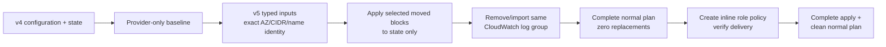

# Migration from v4

This example is a **state-migration skeleton**, not a new-network template. It demonstrates:

- preservation of v4 subnet group keys and physical Name-tag formulas;
- explicit production AZ/CIDR ordering copied from v4 state;
- Tier 2 compatibility aliases while consumers move to Tier 1;
- a 63-block `moved.tf` catalog covering the demonstrated feature union;
- the exceptional remove/import cutover for a v4-created CloudWatch log group;
- an ordered Flow Logs IAM policy transition with no delivery-permission gap.

Follow the user-facing [v5 upgrade guide](../../docs/UPGRADE-GUIDE-5.0.md). The detailed [migration RFC](../../../docs/rfc/v5-migration.md) records rationale and fixture evidence.

## State transition



## Rehearse safely

1. Clone the caller configuration and a copy of production state into an isolated backend/workspace.
2. Replace every synthetic ID, ARN, CIDR, AZ, generated log-group name, and IAM role prefix in `main.tf`.
3. Copy `moved.tf` to the caller root. Keep only addresses present in `terraform state list`; repeat per actual private group/AZ.
4. Run `terraform init` and the exact staged commands in the upgrade guide. Do not use `terraform apply` on this sample unchanged.
5. Require zero replacements in the complete plan and verify every durable physical ID before testing against production state.

The example has two AZs and a feature-union catalog. The catalog size is not a migration target: the real remediation fixture selected 26 moves and omitted 37 absent sources.

## Why the CloudWatch log group is different

v4 used `name_prefix`; v5 owns a fixed `name`. A `moved` block would re-address state but still propose replacement. Capture the real generated name, configure it under `flow_logs.default.cloudwatch_options.name`, materialize ordinary moves first, then remove/import the same physical group exactly as documented. The IAM role can use a normal move only when its exact v4 `name_prefix` is preserved.

## Validation-only commands

These commands prove syntax and provider compatibility; they do **not** prove a migration:

```shell
terraform init -backend=false
terraform validate
```

Migration acceptance always requires a complete normal plan against copied real state, followed by the physical-ID and Flow Logs delivery checks in the upgrade guide.
