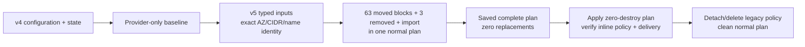

# Migration from v4

This example is a **state-migration skeleton**, not a new-network template. It demonstrates:

- preservation of v4 subnet group keys and physical Name-tag formulas;
- explicit production AZ/CIDR ordering copied from v4 state;
- Tier 2 compatibility aliases while consumers move to Tier 1;
- a 63-block `moved.tf` catalog covering the demonstrated feature union;
- a declarative, same-plan ownership handoff for the v4 log group and legacy IAM policy artifacts;
- a zero-destroy Flow Logs IAM transition with cleanup only after delivery verification.

Follow the user-facing [v5 upgrade guide](../../docs/UPGRADE-GUIDE-5.0.md). The detailed [migration RFC](../../../docs/rfc/v5-migration.md) records rationale and fixture evidence.

## State transition



## Rehearse safely

1. Clone the caller configuration and a copy of production state into an isolated backend/workspace.
2. Replace every synthetic ID, ARN, CIDR, AZ, generated log-group name, and IAM role prefix in `main.tf`.
3. Copy `moved.tf` to the caller root. Keep only addresses present in `terraform state list`; repeat per actual private group/AZ.
4. Copy all three commented root `removed` blocks plus the `import` block from `main.tf`; their module segments intentionally omit `[0]` instance keys. Then run the saved normal-plan gate in the upgrade guide. Do not apply this sample unchanged.
5. Require zero destroys and zero replacements, apply the reviewed plan, verify the inline policy and new log events, then run the documented IAM CLI cleanup.

The example has two AZs and a feature-union catalog. The catalog size is not a migration target: the real remediation fixture selected 26 moves and omitted 37 absent sources.

## Why the CloudWatch log group is different

v4 configured `name_prefix`; v5 configures the exact fixed `name`. AWS provider 6.59 marks both fields `Optional + Computed + ForceNew`. Its importer reads by physical name and then records both the observed `name` and a derived, provider-computed `name_prefix`; import does **not** clear the prefix. Because v5 configures the exact observed `name` and omits `name_prefix`, no naming replacement is required. The root handoff uses unindexed module addresses in three `removed { destroy = false }` blocks: log group, managed policy, and attachment. The log group is imported at its v5 address; the IAM role keeps a normal move and requires its exact v4 `name_prefix`. The two forgotten IAM objects remain temporarily in AWS and are detached/deleted only after the inline policy and continued delivery are verified.

The declarative handoff requires Terraform >= 1.7 because `removed { destroy = false }` is newer than import blocks. Terraform < 1.5 cannot run this v5 module. As an ownership plan B, set `create_destination = false` and inject the existing log-group ARN after a separate logging stack owns it; the VPC module then manages only the Flow Log.

## Validation-only commands

These commands prove syntax and provider compatibility; they do **not** prove a migration:

```shell
terraform init -backend=false
terraform validate
```

Migration acceptance always requires a complete normal plan against copied real state, followed by the physical-ID and Flow Logs delivery checks in the upgrade guide.
