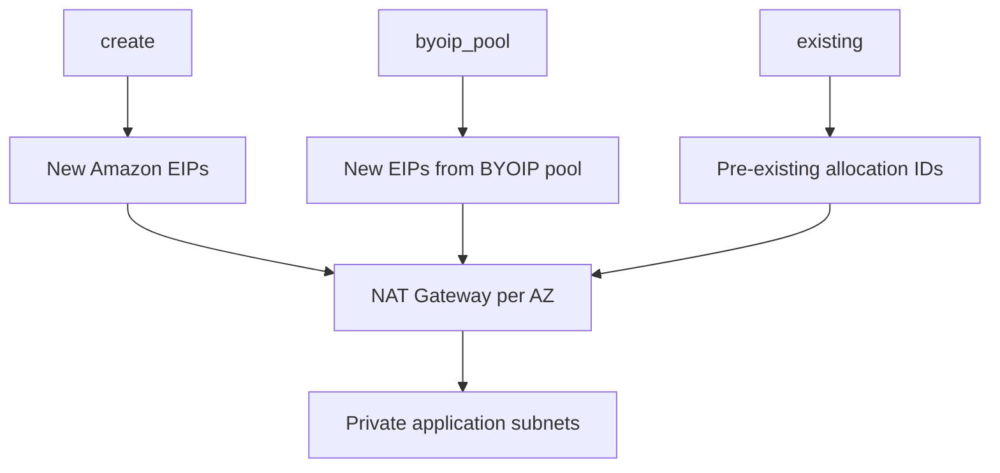

# NAT Gateway EIP sourcing

This example compares all three public NAT Gateway EIP contracts with identical two-AZ subnet topologies:

1. `create`: allocate ordinary Amazon public EIPs;
2. `byoip_pool`: allocate new EIPs from a customer-owned public IPv4 pool;
3. `existing`: attach caller-supplied EIP allocation IDs without owning their lifecycle.



The mode changes EIP ownership only. In every case the module creates two NAT Gateways and routes the private application subnets through the AZ-local NAT.

## Run

The defaults for the BYOIP pool and existing allocation IDs are syntax-safe placeholders. Replace them with resources from the selected account and Region before applying. This example creates six billable NAT Gateways.

```shell
terraform init
terraform plan \
  -var='public_ipv4_pool=ipv4pool-ec2-REAL' \
  -var='existing_eip_allocation_ids={us-east-1a="eipalloc-REAL1",us-east-1b="eipalloc-REAL2"}'
terraform apply
terraform output nat_eip_allocation_ids
terraform destroy
```

`existing_eip_allocation_ids` keys must exactly equal the NAT AZ set. The existing EIPs remain caller-owned after destroy; EIPs allocated in `create` and `byoip_pool` modes are module-owned.
