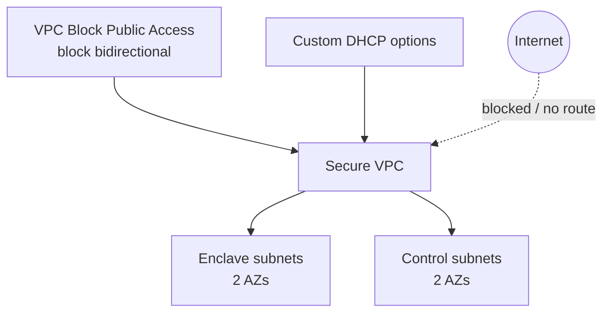

# Secure isolated enclave

This example combines the v5 D6 controls into an enclave/air-gapped topology:

- VPC Block Public Access in `block-bidirectional` mode;
- a custom DHCP option set with a private domain, Amazon-provided DNS, and Amazon Time Sync;
- two subnet groups whose semantic role is exclusively `isolated`;
- no Internet Gateway, egress-only Internet Gateway, NAT Gateway, or managed egress route.

Use this pattern for restricted processing zones, offline control planes, regulated data enclaves, or workloads whose ingress and egress must traverse separately governed private endpoints or inspection infrastructure. Add VPC endpoints and explicit private connectivity as separate resources; do not change an isolated group into a routed group implicitly.



## Regional singleton warning

`aws_vpc_block_public_access_options` is an account/Region singleton. Manage it from exactly one module instance. Applying this example changes the regional setting and can affect other VPCs in the account, so use an isolated test account or coordinate the change with the account networking owner.

## Run

```shell
terraform init
terraform plan
terraform apply
terraform output egress_resources
terraform destroy
```

A clean plan should show no IGW, NAT Gateway, EIGW, or egress routes. Destroy removes the regional BPA configuration created by this example, so do not use it as an uncoordinated demonstration in a shared account.
